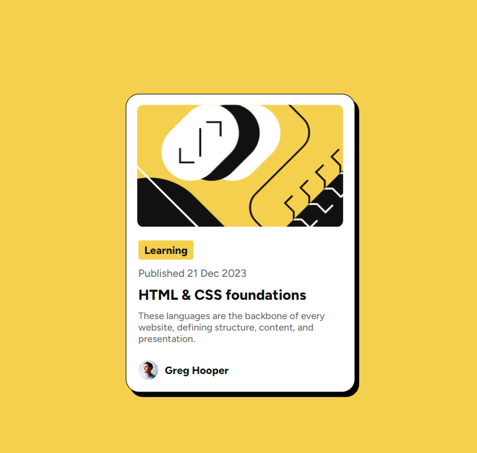

# Frontend Mentor - Blog preview card solution

This is a solution to the [Blog preview card challenge on Frontend Mentor](https://www.frontendmentor.io/challenges/blog-preview-card-ckPaj01IcS). Frontend Mentor challenges help you improve your coding skills by building realistic projects.

## Table of contents

- [Frontend Mentor - Blog preview card solution](#frontend-mentor---blog-preview-card-solution)
  - [Table of contents](#table-of-contents)
  - [Overview](#overview)
    - [The challenge](#the-challenge)
    - [Screenshot](#screenshot)
    - [Links](#links)
  - [My process](#my-process)
    - [Built with](#built-with)
    - [What I learned](#what-i-learned)
    - [Continued development](#continued-development)
  - [Author](#author)

**Note: Delete this note and update the table of contents based on what sections you keep.**

## Overview

### The challenge

Users should be able to:

- See hover and focus states for all interactive elements on the page

### Screenshot



### Links

- Solution URL: [Solution](https://github.com/OmarRafat975/Blog-preview-card)
- Live Site URL: [Live Site](https://omarrafat975.github.io/Blog-preview-card/)

## My process

### Built with

- Semantic HTML5 markup
- CSS custom properties
- Flexbox
- CSS Grid

### What I learned

I learned how to deal with a background image and how to use it.

```html
<div class="img"></div>
```

```css
.container .img {
  position: absolute;
  background-image: url("./assets/images/illustration-article.svg");
  background-position: center;
  background-repeat: no-repeat;
  background-size: cover;
  width: 310px;
  height: 185px;
  margin-top: -14.5rem;
  text-align: center;
  border-radius: 10px;
}
```

### Continued development

I Want To focas more in CSS because I found it hard to play with ;)

## Author

- Website - [Omar Rafat](https://github.com/OmarRafat975)
- Frontend Mentor - [@OmarRafat975](https://www.frontendmentor.io/profile/OmarRafat975)
